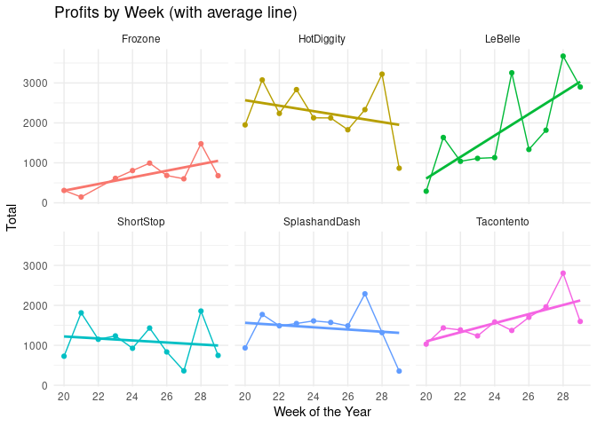

BYU-Idaho’s Shark Tank: Comparing Which Student-Run Business Is Worth
Investing In
================
Ricky Warner
2020-11-08

# Background

As part of the Business Program at BYU-Idaho, all business students are
required to create and manage a business as part of their degree. As
part of one of our case studies for Data Wrangling and Visualization
(MATH 335), we received a compiled list of all transactions across all
student run businesses from April until July 2016. Our task was to clean
the dates using the lubridate package and gain additional insights into
the financials of each student run business. I approached this as if I
was a potential investor looking to invest in one of the student run
businesses. Below details some of the insights I gained researching each
company as well as my final pick if I were to invest in one of the
businesses.

``` r
# Cleaning Data
cost <- cost %>%
  # As part of the cleaning process, we have to change the date column into a lubridate format. We can then change the time zone, and then extrapolate details such as month, day of the week, etc.
  mutate(time = ymd_hms(Time, tz = "UTC")) %>%
  mutate(time = with_tz(time, tz = "MST")) %>%
  mutate(month = month(time)) %>%
  mutate(day = wday(time, label = TRUE)) %>%
  mutate(week = week(time)) %>%
  mutate(daymonth = day(time)) %>%
  mutate(hour = hour(time)) %>%
  mutate(absvalue = abs(Amount)) %>%
  filter(Name != "Missing") %>%
  select(Name, Type, Amount, time, month, day, week, hour, daymonth, absvalue)


negatives.total <- cost %>% # Some of the transactions in the dataset are negative. We'll want to do a bit more research into these values 
  filter(Amount < 0) %>%
  mutate(positive = Amount * -1) %>%
  group_by(Name) %>%
  summarize(total = sum(positive))

negatives.count <- cost %>% # Some of the transactions in the dataset are negative. We'll want to do a bit more research into these values 
  filter(Amount < 0) %>%
  group_by(Name) %>%
  count(Name) %>%
  rename(count = n)

positive <- cost %>% # This dataset will be what we use for the majority of our analysis.
  filter(Amount > 0)


week <- positive %>% # Group transactions by company and week 
  group_by(Name, week) %>%
  summarise(total = sum(Amount))

day <- positive %>% # Grouip transactions by company and day 
  group_by(Name, day) %>%
  summarise(total = sum(Amount))

month <- positive %>% # Group transactions by company and month 
  group_by(Name, month) %>%
  summarise(total = sum(Amount))

hour <- positive %>%
  group_by(Name, hour) %>%
  summarise(total = sum(Amount))
```

## Returns

All of the student-run businesses experienced returns. HotDiggity has
the highest returns at a grand total of 1476.63 while Frozone holds the
lowest total of 569.14. While this could suggest that HotDiggity has the
highest customer dissatisfaction rate, it is important to remember that
HotDiggity could be offering a more expensive product.

``` r
negatives.total %>% # Change this to be a bar chart containing the totals for each company 
      ggplot(aes(x=Name, y=total, fill=Name)) +
      geom_bar(stat="identity") +
      theme_minimal() + 
      labs(x = "Month of the Year",
           y = "Total Amount (In Dollars)",
           title = "Returns by Company (In Dollars)") +
      theme(legend.position = "none")
```


In order to get a better understanding of the returns, we’ll need
compare returns per company by total count. A count of all returns by
company reveals that while Hotdiggity is indeed the leader for returns
at 70 returns; however, Frozone is actually not far behind it with a
grand total of 56 returns. This graph reveals that Tacento is actually
the lowest company for returns with a grand total of 41 returns. This
could suggest that Tacento had the highest customer satisfaction with
their product.

``` r
negatives.count %>%
      ggplot(aes(x=Name, y=count, fill=Name)) + 
      geom_bar(stat="identity") + 
      theme_minimal() + 
      labs(x = "Company",
           y = "Number of Returns",
           title = "Returns by Company by Count") + 
      theme(legend.position = "none",
            axis.title.y = element_text(margin = margin(t = 0, r = 20, b = 0, l = 0)))
```


## Total Revenue Generated

Probably one of the most important indicators of how successful a
company is is revenue generated. According to the graph below, it
appears that HotDiggity leads in terms of total revenue generated.

``` r
positive %>%
  group_by(Name) %>%
  summarize(Total = sum(Amount)) %>%
  ggplot(aes(Name, Total, fill = Name)) + 
  geom_bar(stat = "identity") + 
  theme_minimal() + 
  theme(legend.position = "none") + 
  labs(
    x = "Total Sales in Dollars",
    y = "Company",
    title = "Total Revenue By Company"
  )
```


# Forecasting Future Growth

Another important factor that we need to consider in evaluation of
companies is overal trend. While their sales might be strong, there
might be evidence of lowering profits which isn’t good for the overall
company. From the graph below, it appears that Frozone, LaBelle, and
Tacento show the strongest signs of growth and theirfore would be a
safer inverstment. The others appear to have negative trends which
doesn’t look good.

``` r
 week %>%
  ggplot() + 
  geom_line(aes(week, total, col = Name)) +
   geom_point(aes(week, total, col = Name)) +
  labs(x = "Week of the Year",
       y = "Total",
       title = "Profits by Week (with average line)") +
  facet_wrap(~Name) + 
   geom_smooth(aes(week, total, col = Name), method = "lm", se = F) +
   scale_x_discrete(limits = seq(20,28,2)) +
   theme_minimal()
```



# Final Decision

After carefully reviewing the data, I have come to the conclusion that
out of all of the companies that were reviewed, I would invest in
LaBelle. LaBelle was in the middle with total of 57 returns. It also had
the second highest revenue generated at 18185.55. The most promising
factor in this decision is the forecast. According to the forecast,
LaBelle had the most promsing long term growth, suggesting outpacing
even HotDiggity in terms of total revenue.

# Other Information We Would Need To Make A Decision

While the data presents a nice picture into the finanicials of the
company. There is additional information that would be greatly
beneficial in determining whether or not the company is worth investing
in:

<br> Profit Margins: We currently have no idea how much it costs to make
each product. This is very critical as even if the company is making
enough sales, it might not be enough to cover total company expenses.
<br> Employees: We would need an understanding how much we would have to
pay each employees as well as how many employees the company would need
to meet customer demand. <br> Customer Reviews: It would be beneficial
to have some customer feedback as to what they like and dislike. A
rating system like stars could also be beneficial to provide a
quantitative understanding of how popular the company is as well. <br>
Expenses/Debt: How is the company’s financial standing? Does it have a
healthy amount of debt? How much have they paid off the equipment? Are
there any routine or upcoming investments that will need to be made in
order to help the growth of the company?

# Bonus: Hourly Sales Analysis

An interesting note is that all of the companies appear to have better
sales on Fridays over any other day. The only exception is SplashandDash
which appears to have Thursday as their most impressive day.

``` r
positive %>%
  filter(day != "Sun" & day != "Sat") %>%
  group_by(day, Name) %>%
  summarize(total = sum(Amount)) %>%
  ggplot() +
  geom_bar(aes(day, total, fill = day), stat = "identity") + theme_minimal() +
  labs(x = "Day of the Week",
       y = "Total Amount Earned (in dollars)",
       title = "Total Profits for Each Company") + facet_wrap(~Name)
```


